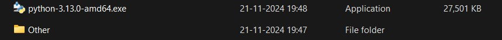
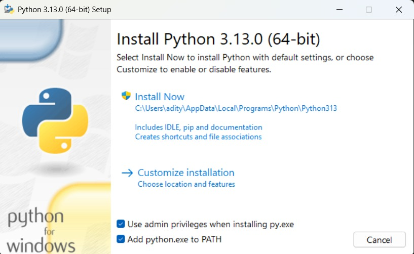
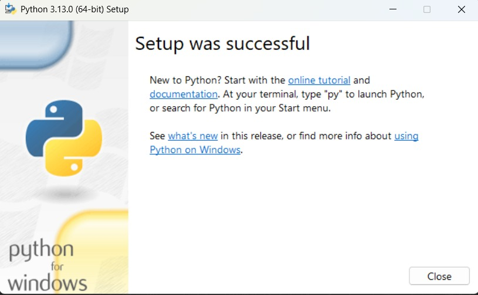
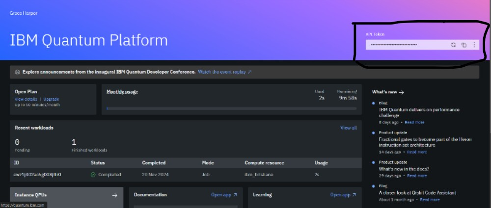
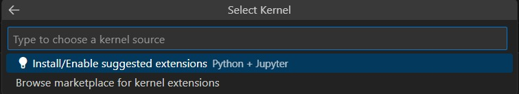
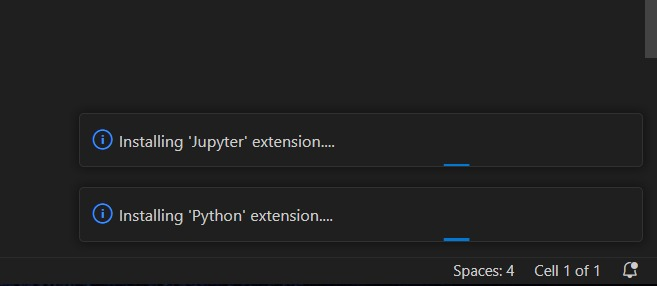
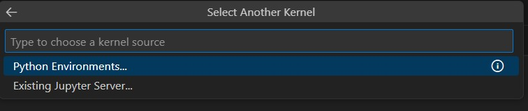

# Setting Up Qiskit in Visual Studio Code

##### Internet Required:- 200-300MB
##### Softwares Needed:- Visual Studio Code, Python

### **Downloads**

[Python](https://www.python.org/ftp/python/3.13.0/python-3.13.0-amd64.exe)

#
**Installing Python**\
\
Step 1.\
\
\
\
Step 2. Check all the boxes\
\
\
\
Step 3. Click Yes on interrupt\
\
Step 4.\
\
\
\
Installed Successfully!

#
Installing Required Libraries one by one using command prompt(search cmd in search box of windows)

```Python
pip install qiskit
```
```Python
pip install qiskit-ibm-runtime
```
```Python
pip install matplotlib
```
```Python
pip install pylatexenc
```
#
Register Here and copy the api token and replace #yourapi# with your api token\
\
[IBMQuantum](https://quantum.ibm.com/)\
\
\
#
\
Open Visual Studio Code\
\
Create a new file by any name but make sure to save as **.ipynb**\
Copy this code into it a new cell
####
```python
import qiskit
from qiskit_ibm_runtime import QiskitRuntimeService
service= QiskitRuntimeService
service.save_account(channel="ibm_quantum", token="#yourapi#")
from qiskit_ibm_runtime import QiskitRuntimeService
service=QiskitRuntimeService(channel='ibm_quantum')
backend=service.backend(name="ibm_brisbane")
print(f"backend name: {backend.name}")
print(f"number of qubits: {backend.num_qubits}")
```
\
Then run the code by clicking the side play button of the cell\
\
Click on first option\
\
\
\
Let it complete and fade out\
\
\
\
Click on first option\
\
\
\
and again Click on first option for Python 3.13\
\
Now you can code seamlessy 
#
Task accomplished!!!
#
If any issue arises, Contact at my mail: theastralx@gmail.com
